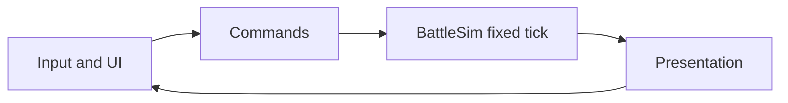
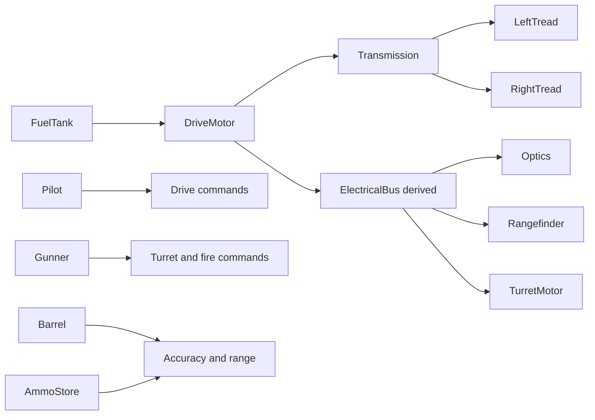

# ProStrats Roadmap

ProStrats is a simulation-first real-time strategy game. Units do not have an abstract health bar. What a unit can do is the output of its parts: treads, motors, drivetrain, sensors, stores, weapons, and crew. Damage changes part condition, and condition changes function.

Battles target about 100 units per side on a high-end consumer PC (Ryzen 9 7950X3D, RTX 4080 Super). The game is about front lines, maneuvers, and the battlefield effect of losing a specific system, not about fielding a swarm.

This document is the path forward. When direction changes, edit the future phases here. Do not rewrite settled history; record what happened in [CURRENT-STATUS.md](CURRENT-STATUS.md).

## Design pillars

- **No unit health pool.** Integrity lives on parts. A tank is destroyed because its ammo detonated, its crew is dead, or it can no longer move and fight, not because a hit-point counter reached zero.
- **Approximated systems, precise outcomes.** Wheels, axles, and treads transfer power from motors through a drivetrain. Sensors set vision and targeting. Heat builds in motors. These are models with thresholds, not a rigid body per wheel.
- **Condition is continuous, bands are the language.** Each part stores integrity in `[0, 1]`. Bands are derived from that value. Function (speed, vision, traverse, accuracy) comes from a per-part curve of integrity, not from the band name alone.

| Band | Integrity | Meaning |
| --- | --- | --- |
| Nominal | ≥ 0.75 | Full function for that part's curve |
| Compromised | ≥ 0.40 and < 0.75 | Reduced function |
| Disabled | ≥ 0.05 and < 0.40 | Part is present and produces no output |
| Dismantled | < 0.05 | Part is gone. Structural consequences may apply (detonation, killed crew, lost volume) |

- **Single player through Phase 5.** The simulation uses a fixed tick so a later deterministic or lockstep mode stays possible. No networking is in these phases.
- **Strategy scale.** Systems are built for roughly 200 live units with rich part graphs. They are not built for thousands of simple bodies.

## Non-goals for Phases 1–5

- Abstract hit points, armor bars, or a single "unit dead" threshold that ignores parts.
- WheelCollider or per-wheel rigid-body physics as the source of movement truth.
- DOTS / Entities as the gameplay architecture. Burst and compute shaders remain available for ballistics and terrain when those phases need them.
- Swarm counts, box-select-as-the-core-loop before command groups exist, or an economy before Phase 3.
- Multiplayer, replays, and lockstep. The tick is only kept fixed so those are not painted out.

## Architecture

Unity is the presentation layer. The battle simulation is authoritative C# and does not live in `MonoBehaviour`s.

- **Simulation** (`ProStrats.Simulation`): plain C#, `Unity.Mathematics`, 20 Hz fixed step. Owns units, part graphs, orders, and derived capabilities. EditMode tests cover this assembly. It does not reference physics or UI.
- **Presentation** (`ProStrats.Presentation`): GameObjects, meshes, decals, the selection outline, and the camera. Reads sim state. Writes only by submitting commands.
- **UI** (`ProStrats.UI`): UI Toolkit. The command card and the development conditioner call into the same command API as the world.
- **Tests** (`ProStrats.Simulation.Tests`): EditMode tests for band mapping, powertrain limits, steering, crew stun, and detonation.

Intended layout once Phase 1 starts:

- `Assets/ProStrats/Simulation/`
- `Assets/ProStrats/Presentation/`
- `Assets/ProStrats/UI/`
- `Assets/ProStrats/Tests/EditMode/`

`Assets_dst/` and `ProjectSettings_dst/` are leftover template copies. They are not source.

AI Navigation is already in the project and stays unused in Phase 1. Movement on the flat plane is kinematic differential drive. Orders talk to a path seam (`IPath` / "go to this point") so a later pathfinder can replace straight-line travel without rewriting the command model.

Rendering stays on GameObject renderers and URP until a profile says otherwise. Two hundred simple tanks do not justify Entities.

## Medium tank part graph

The first archetype is a traditional medium armored tank: two tread sets, a hull, and a rotating turret with a main cannon. Parts are assemblies. A later archetype can add children (road wheels under a tread) without replacing the graph.

| Part | Role |
| --- | --- |
| Left tread | Traction on the left side |
| Right tread | Traction on the right side |
| Drive motor | Torque for the drivetrain; also feeds the electrical bus. Builds heat under load |
| Turret motor | Traverse rate. Builds heat under load |
| Transmission | Splits drive torque to the treads. Holds a local-space oriented box for later piercing shots |
| Optics | Vision range. Draws from the electrical bus |
| Rangefinder | Targeting quality. Draws from the electrical bus |
| Fuel tank | Fuel present. Dismantled kills drive power and flags a fire |
| Ammo store | Rounds present. Dismantled detonates this unit |
| Barrel | Accuracy and range. Dismantled cannot fire |
| Pilot | Drive station. Stun or death takes drive offline |
| Gunner | Turret and fire station. Stun or death takes them offline |

The electrical bus is derived, not a hit location. The drive motor feeds it while running. A short reserve keeps optics and the turret motor from dying on the same frame the engine stops.

### Mobility

Straight speed scales with `min(left tread, right tread)` times drive-motor output times transmission output. A weaker tread reduces speed. A disabled tread sets straight speed to 0. The surviving tread can still pivot the hull in place.

The pilot station has to be online for drive commands to apply. A stunned or dead pilot produces no throttle.

### Heat

Drive and turret motors accumulate heat from load and cool toward ambient. Hot integrity-equivalent bands cut output. Overheat disables that motor until it cools. The simulation exposes `AddHeat` so weapons in Phase 2 can dump thermal load. Phase 1 can inject heat from the debug conditioner.

### Crew

Pilot and gunner each have integrity and a stun timer. Stun blocks that station until it expires. Dismantled kills that crewmember and leaves the station offline. The archetype flag `CanReman` is false on this tank and exists so a later large vessel can bring a station back.

### Stores and the gun

- Ammo dismantled runs a self-detonation: that unit's parts are destroyed. Neighbor damage is Phase 2.
- Fuel dismantled removes drive power and flags a fire. Area ignition is Phase 2.
- The barrel scales accuracy and range. A dismantled barrel cannot fire.
- The transmission's oriented box is data on the archetype in Phase 1. Projectile queries against it arrive with piercing rounds, which are not the Phase 2 explosive.

## Phases

### Phase 1 — Template battlefield

**Status:** Not started

A flat battlefield, one tank archetype, selection and movement, and a part model you can break by hand.

**In scope**

- New scene `Assets/Scenes/Battle.unity`: large flat plane, URP lighting, skybox. `Battle` is the only enabled build scene.
- RTS camera: WASD pan, screen-edge pan, zoom, yaw.
- Several primitive medium tanks (hull, turret, barrel, two tread meshes) as the view of the archetype.
- Click to select. Click empty ground to deselect. Right-click ground to move. No move queue: a new move replaces the previous one.
- Bottom UI Toolkit card for the selected unit: portrait placeholder, current and max stats for each part, and Move / Attack / Stop buttons.
- Move button enters a place-on-ground mode that issues the same move command as right-click.
- Attack is a real order. If the gunner, turret motor, and barrel allow it, the turret traverses toward the point. No projectile is spawned.
- Stop clears the current order and throttle.
- Selected unit: URP decal aura on the ground plus an outline from a URP renderer feature. Both turn off when the unit is deselected.
- Move-order decal at the destination. It is removed when the unit arrives, or when a new non-queued move replaces it.
- Vision ring on the selected unit, radius from optics output.
- Development-only debug conditioner (Editor and Development builds): set a part's integrity band, inject heat, apply stun. Hidden from release players.
- Tread visuals reflect motion and condition (scroll or equivalent while moving; darken or drop the mesh when that side is disabled or dismantled).
- EditMode tests: band thresholds, straight-speed cap, pivot with one dead tread, pilot stun blocking drive, ammo self-detonation, fuel dismantle cutting drive power.

**Out of scope**

- Projectiles, shock damage, neighbor blasts, armor penetration.
- Terrain deformation, SDF fields, NavMesh, obstacles.
- Control groups, formations, multi-select, shift-queued orders.
- Bases, resources, fog of war beyond the selected unit's vision ring.
- Remanning crew. `CanReman` is stored and false.

**Exit criteria**

- Play Mode in `Battle` shows the plain, the sky, and multiple tanks.
- Selecting a tank shows the aura, the outline, the vision ring, and the command card.
- Move and Stop work from both the mouse and the buttons. The move marker matches the order lifecycle above.
- Attack aims the turret and does not fire.
- The debug conditioner can slow a tank, kill straight-line travel while leaving pivot, blind it, stun a station, overheat a motor, flag a fuel fire, and detonate it via the ammo store.
- EditMode tests for those rules pass.

### Phase 2 — Fire and ground

**Status:** Not started

The ground becomes a signed distance field, and the cannon starts applying shock.

**In scope**

- Replace the flat mesh landscape with an SDF. The first field is a low-noise plain.
- A dual-contour compute shader meshing that field, including deformation.
- Ballistic main-cannon fire from the Phase 1 attack order.
- Explosive rounds that do not pierce the tank's shell. They accumulate shock and impact on parts, especially treads on a direct or near hit, and they deform the field.
- The transmission volume stays the intended target for a later piercing round. It is not what explosives query.

**Out of scope**

- Piercing ammunition, neighbor-chain reactions beyond what a single detonation needs, command groups, the map editor.

**Exit criteria**

- A shot from the medium tank lands on a ballistic arc, scars the SDF, and reduces tread function on a near miss without using a unit health pool.
- A dismantled ammo store can damage neighbors through the same shock path used by explosives.
- Deforming the field updates the mesh a unit drives on.

Shock falloff, armor coefficients, and blast radius are chosen at the start of this phase, not before.

### Phase 3 — Groups and economy

**Status:** Not started

**In scope**

- Command groups: create, select, and update a group that orders its members together.
- Move becomes move-in-formation for a group.
- A minimized unit card so several units can be read at once.
- Team bases and mineral extraction.

**Out of scope**

- The map editor, the garage, unit authoring beyond the medium tank.

**Exit criteria**

- A group can be formed and sent as one formation.
- Two bases can fund a fight from extracted minerals.
- The minimized cards stay readable with a handful of units selected.

Formation shapes and economy numbers are chosen at the start of this phase.

### Phase 4 — Map editor

**Status:** Not started

**In scope**

- Author and save SDF terrain: sculpt, noise, and the low-noise plain as a starting template.
- Load a saved field into the battle scene.

**Out of scope**

- A full campaign map, triggers, or scripted scenarios.

**Exit criteria**

- A field made in the editor loads into a battle and can be deformed by Phase 2 weapons.

### Phase 5 — Garage

**Status:** Not started

**In scope**

- Additional unit archetypes built on the same part graph.
- A unit editor ("garage") for assembling parts and tuning curves, volumes, and crew flags.
- Field upgrades that add a part or change an existing one during a battle.

**Out of scope**

- A persistent metagame or unlock tree beyond what a single battle needs to apply an upgrade.

**Exit criteria**

- A second archetype can be fielded without a one-off movement or damage path.
- An upgrade changes a live unit's part graph and the command card follows it.

Which upgrades exist, and whether they add parts or only mutate curves, is decided at the start of this phase.

## How to change this document

- Mark a phase `In progress` when implementation starts and `Done` when its exit criteria are met.
- If a later phase's scope changes, edit that phase here and add a decision entry to [CURRENT-STATUS.md](CURRENT-STATUS.md).
- Leave completed phases as they were shipped. Corrections to history go in the status log, not by silently rewriting the phase.
- Open numbers (shock coefficients, formations, mineral rates, upgrade lists) stay unnamed until that phase begins.
